# Guía de Buenas Prácticas de Desarrollo Frontend
**Proyecto:** Landing Page y CMS Centro de Negocios Santiago.

**Tecnologías Principales:** Nuxt 4, Vue 3, @nuxt/ui, Tailwind CSS, Pinia, Zod, Better-SQLite3

Este documento establece los estándares y pautas aplicadas por nuestro equipo durante el desarrollo del proyecto, asegurando la mantenibilidad, accesibilidad y escalabilidad del código. Se detallan 10 prácticas fundamentales divididas por categorías.

---

## I. Convenciones de Nomenclatura

### Práctica 1: Nombrado de Componentes en PascalCase
* **Nuestra regla:** Utilizar estrictamente el formato `PascalCase` para el nombramiento de los archivos `.vue` en la carpeta `components/`.
* **¿Qué usamos?:** El sistema de auto-imports nativo de Nuxt.
* **¿Cómo lo comprobamos?:** Revisando el árbol de archivos, el 100% de los componentes inician con mayúscula (ej. `ServiceCard.vue`), lo que permite que Nuxt los auto-importe correctamente sin errores en consola.
* **¿Por qué lo hacemos?:** Para mejorar la legibilidad y diferenciar visualmente en el template nuestras piezas de código Vue de las etiquetas HTML estándar.
* **Ejemplo concreto:** > *Incorrecto:* `<servicecard />` | *Correcto:* `<ServiceCard />`

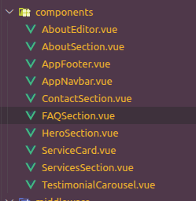
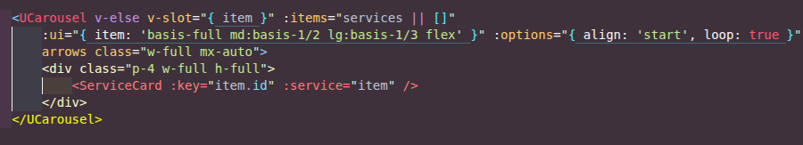

### Práctica 2: Declaración de Variables y Funciones en camelCase
* **Nuestra regla:** Emplear notación `camelCase` para todas las variables reactivas, referencias y funciones dentro del bloque `<script setup>`.
* **¿Qué usamos?:** Convenciones estándar de JavaScript/TypeScript y revisiones de código.
* **¿Cómo lo comprobamos?:** Revisando la lógica de los componentes, no existen variables en `snake_case` o `PascalCase`. Variables como `formCategoria` o `cargandoFaq` reflejan este estándar.
* **¿Por qué lo hacemos?:** Para mantener la consistencia semántica en todo el equipo, facilitando la identificación rápida de propiedades frente a clases o componentes.
* **Ejemplo concreto:** > *Incorrecto:* `const Cargando_Faq = ref(false)` | *Correcto:* `const cargandoFaq = ref(false)`

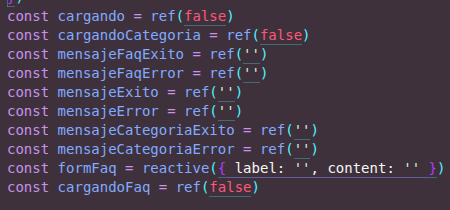
---

## II. Estructura de Archivos

### Práctica 3: Enrutamiento Basado en Archivos para la API (Modularidad)
* **Nuestra regla:** Separar los endpoints del servidor por dominio de datos (ej. `services`, `faqs`, `categories`) utilizando la estructura de carpetas basada en archivos.
* **¿Qué usamos?:** El motor Nitro del framework para generar rutas automáticamente a partir del árbol de directorios en `server/api`.
* **¿Cómo lo comprobamos?:** Cada entidad tiene su propia carpeta con archivos separados según el método HTTP (ej. `index.get.ts` para GET, `[id].delete.ts` para DELETE).
* **¿Por qué lo hacemos?:** Para evitar archivos monolíticos gigantes y facilitar el mantenimiento. Un desarrollador nuevo puede ubicar la lógica de eliminación de una categoría de forma intuitiva.
* **Ejemplo concreto:** > Acceder a la ruta `GET /api/faqs` se gestiona exclusivamente en `server/api/faqs/index.get.ts`.

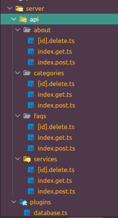
---

## III. Gestión de Estado, Variables y Tipado

### Práctica 4: Tipado Estricto de Datos con TypeScript (Interfaces)
* **Nuestra regla:** Definir `interfaces` explícitas para todas las estructuras de datos complejas (objetos y arreglos) que consumimos desde la API o manejamos en el estado local.
* **¿Qué usamos?:** TypeScript nativo.
* **¿Cómo lo comprobamos?:** El código incluye declaraciones de `interface` antes de las llamadas a `useFetch`. Las variables están tipadas (ej. `<Faq[]>`) y el editor no arroja errores del tipo `any` implícito.
* **¿Por qué lo hacemos?:** Para prevenir errores en tiempo de ejecución, asegurar la integridad de los datos y aprovechar el autocompletado inteligente en el IDE.
* **Ejemplo concreto:** > *Incorrecto:* `const { data } = await useFetch('/api/services')` | *Correcto:* `const { data: services } = await useFetch<Service[]>('/api/services')`

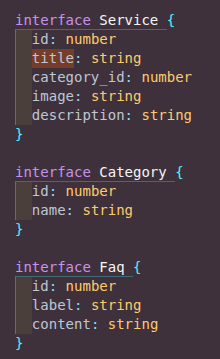

### Práctica 5: Uso Semántico de `ref` vs `reactive`
* **Nuestra regla:** Utilizar `ref` para valores primitivos (booleanos, strings, números) y `reactive` exclusivamente para agrupar estados relacionados en objetos, como los campos de un formulario.
* **¿Qué usamos?:** Vue 3 Composition API.
* **¿Cómo lo comprobamos?:** En los scripts, los estados de carga se declaran con `ref` (`cargandoFaq = ref(false)`), mientras que los datos que viajan juntos se agrupan con `reactive` (`formFaq = reactive({ label: '', content: '' })`).
* **¿Por qué lo hacemos?:** Para mejorar el rendimiento de la reactividad de Vue y hacer que la intención del código sea inmediatamente clara al leerlo.
* **Ejemplo concreto:** > El estado del formulario se muta directamente (`form.title = 'Nuevo'`) sin necesidad de acceder a la propiedad `.value`.

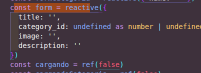

### Práctica 6: Validación Estricta de Esquemas de Variables (Client-Side)
* **Nuestra regla:** Implementar una capa de validación estricta en el cliente para las variables de los formularios antes de procesarlas o enviarlas al servidor.
* **¿Qué usamos?:** La librería `Zod` (declarada en nuestras dependencias) para la validación de esquemas.
* **¿Cómo lo comprobamos?:** Existe un esquema definido (`contactSchema`) y validamos las variables del formulario usando el método `.safeParse(form)` antes de ejecutar la función de envío.
* **¿Por qué lo hacemos?:** Para garantizar que la información cumpla con los formatos requeridos (ej. un email válido), reduciendo peticiones innecesarias o malformadas hacia el backend.
* **Ejemplo concreto:** > `email: z.string().email({ message: 'Debes ingresar un correo válido' })`

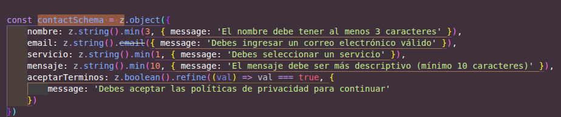
---

## IV. Accesibilidad (WCAG 2.1) y Diseño Centrado en el Usuario

### Práctica 7: Semántica y Atributos ARIA en Componentes Complejos
* **Nuestra regla:** Implementar etiquetas semánticas y atributos ARIA en componentes interactivos complejos para cumplir con el estándar de accesibilidad WCAG 2.1.
* **¿Qué usamos?:** Estándares W3C.
* **¿Cómo lo comprobamos?:** Se evidencia la presencia de atributos `role="region"`, `aria-roledescription="carousel"` y `aria-label` en el componente del carrusel de testimonios.
* **¿Por qué lo hacemos?:** Para garantizar que las tecnologías asistivas (como lectores de pantalla) puedan interpretar correctamente la función del bloque y narrar su contenido a personas con discapacidad visual.
* **Ejemplo concreto:** > `aria-label="Carrusel de testimonios de clientes"` en el contenedor principal.

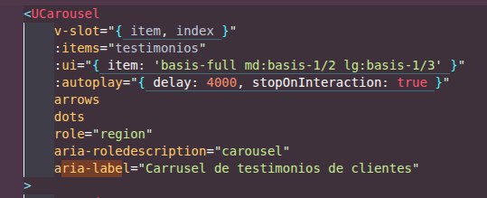

### Práctica 8: Navegación por Teclado y Estados de Foco Visual
* **Nuestra regla:** Asegurar que todos los elementos interactivos sean navegables mediante el teclado (tecla Tab) y posean un indicador visual claro de su estado de enfoque.
* **¿Qué usamos?:** El atributo HTML `tabindex` y clases utilitarias de Tailwind (`focus:`).
* **¿Cómo lo comprobamos?:** Las tarjetas individuales dentro del carrusel cuentan con `tabindex="0"` y clases como `focus:ring-2 focus:ring-white`.
* **¿Por qué lo hacemos?:** Para permitir que usuarios con discapacidades motoras que no pueden usar un ratón naveguen por la plataforma de forma autónoma.
* **Ejemplo concreto:** > `<UCard tabindex="0" class="focus:outline-none focus:ring-2 focus:ring-white">`

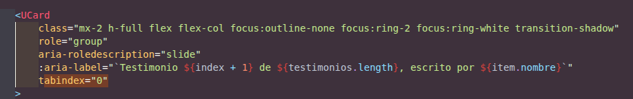
---

## V. Usabilidad y Seguridad de la Interfaz

### Práctica 9: Feedback Visual Inmediato y Manejo de Estados Asíncronos
* **Nuestra regla:** Proveer retroalimentación visual instantánea al usuario durante las operaciones asíncronas (peticiones a la API) y al finalizar las mismas.
* **¿Qué usamos?:** La propiedad `:loading` en los botones de `@nuxt/ui` y renderizado condicional (`v-if`) para las alertas.
* **¿Cómo lo comprobamos?:** El botón de envío usa un indicador de carga (`:loading="cargandoFaq"`), inhabilitándose mientras procesa la solicitud, seguido de un mensaje de éxito/error en pantalla (ej. `mensajeFaqExito`).
* **¿Por qué lo hacemos?:** Para reducir la incertidumbre del usuario respecto al estado del sistema y evitar envíos duplicados por clics múltiples.
* **Ejemplo concreto:** > `<UButton type="submit" :loading="cargandoFaq">Agregar FAQ</UButton>`

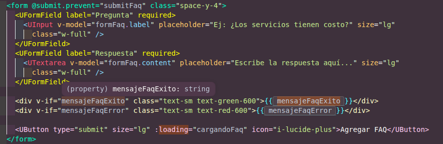

### Práctica 10: Protección contra Spam mediante Honeypot (Usabilidad No Intrusiva)
* **Nuestra regla:** Implementar medidas de seguridad anti-bots en formularios públicos utilizando un campo "Honeypot" oculto, en lugar de utilizar CAPTCHAs tradicionales.
* **¿Qué usamos?:** Inputs HTML ocultos mediante CSS (`class="hidden"`) y validación lógica en el script.
* **¿Cómo lo comprobamos?:** Existe un campo `<input type="text" v-model="form._honeypot" class="hidden" ... />` en el formulario de contacto, y el script bloquea la ejecución si dicho campo contiene algún texto.
* **¿Por qué lo hacemos?:** Para bloquear el spam automatizado manteniendo al mismo tiempo una usabilidad perfecta y sin interrupciones para los usuarios humanos legítimos.
* **Ejemplo concreto:** > `if (form._honeypot !== '') { return console.warn('Bot detectado') }`

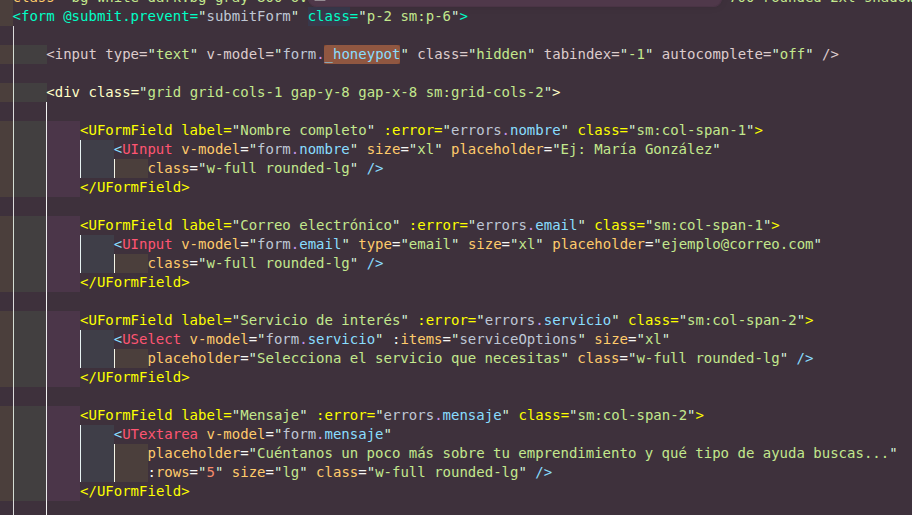