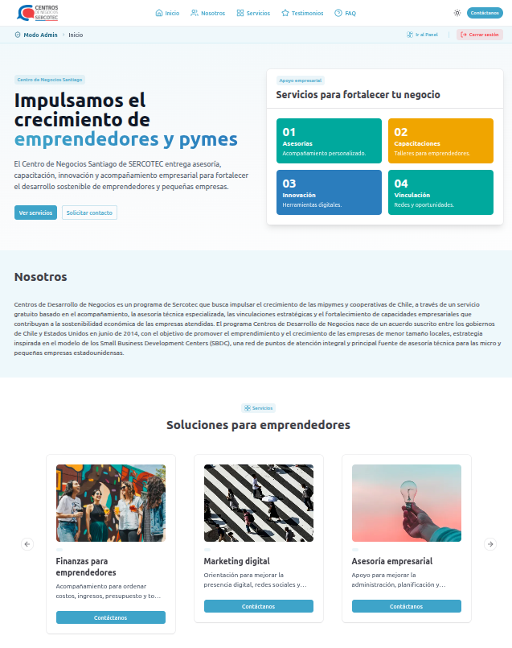
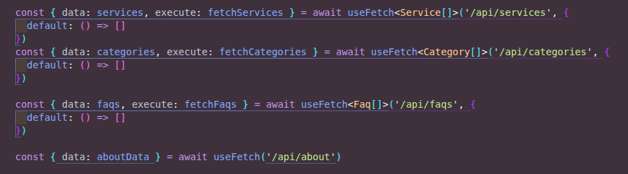
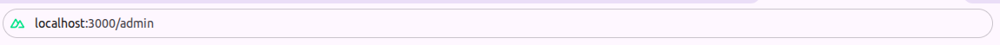
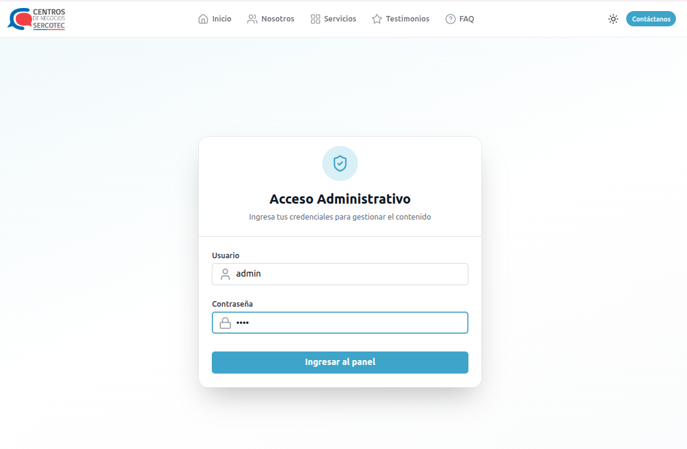
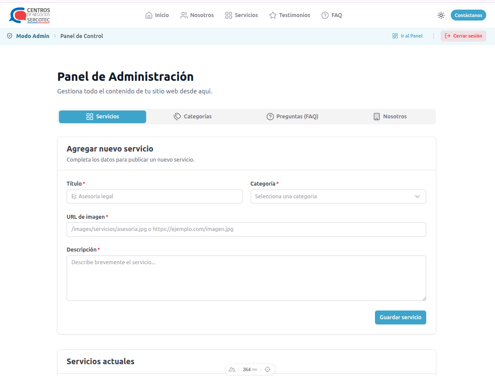
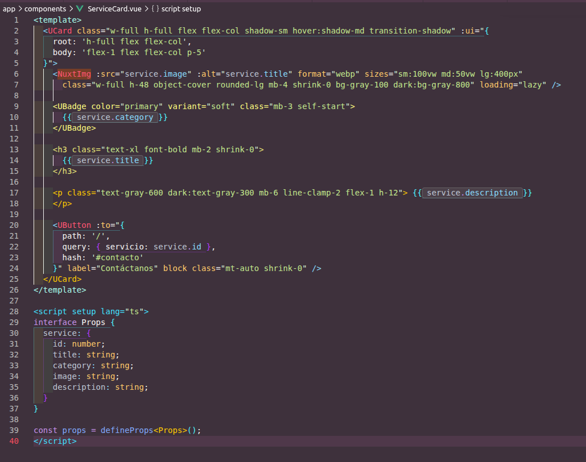

# Proyecto: Landing Page y CMS - Centro de Negocios SERCOTEC


**Equipo de Desarrollo:**
* Mixiu Perez
* Andrea Carreño
* Sofia Benavente



## 1. Descripción del Proyecto

Esta aplicación es una solución web integral desarrollada para el **Centro de Negocios Santiago de SERCOTEC**. El objetivo es proporcionar una interfaz intuitiva, accesible y eficiente para la gestión de servicios de acompañamiento, testimonios y contacto directo, fortaleciendo la vinculación con los emprendedores. Adicionalmente, incluye un Panel de Administración (CMS) a medida para la gestión dinámica del contenido.

## 2. Tecnologías Utilizadas

El proyecto ha sido construido aprovechando las mejores prácticas del ecosistema moderno y priorizando el rendimiento y la seguridad:

* **Framework:** Nuxt 4 / Vue 3.
* **UI/UX:** `@nuxt/ui` y Tailwind CSS para componentes consistentes, responsivos y accesibles.
* **Gestión de Estado:** `Pinia` en conjunto con `@pinia-plugin-persistedstate/nuxt` para el manejo global de datos y persistencia de la sesión del administrador.
* **Seguridad y Validación:** `nuxt-security` para la protección mediante cabeceras HTTP, implementación de "Honeypot" contra bots, y la dupla `VeeValidate` + `Zod` para la validación estricta de formularios en el cliente.
* **Optimización:** `@nuxt/image` para la conversión automática a formatos de próxima generación (WebP) y gestión eficiente de recursos visuales.
* **Base de Datos y Editor:** `Better-SQLite3` para el almacenamiento de datos local y `@tiptap/vue-3` como editor de texto enriquecido para el contenido de la organización.
* **Backend:** API nativa generada con el motor Nitro, estructurada de forma modular en la carpeta `server/api/`.

## 3. Estructura del Proyecto

La arquitectura se ha organizado para fomentar la reutilización, la modularidad y el escalamiento:

```text
├── components/        # Componentes UI reutilizables (ServiceCard, formularios)
├── pages/             # Vistas principales (Landing page, Panel Admin)
├── server/            # Endpoints modulares de la API (categorías, faqs, servicios)
├── stores/            # Gestión de estados globales con Pinia
├── public/            # Archivos estáticos y recursos visuales (logos)
├── docs-images/       # Capturas de pantalla para la documentación técnica
└── nuxt.config.ts     # Configuración central del framework
```

## 4. Guía de Buenas Prácticas

Para garantizar la calidad técnica se aplicaron normativas estrictas de desarrollo (puedes revisar el detalle y la justificación completa en nuestra guía [`BUENAS-PRACTICAS.md`](./BUENAS-PRACTICAS.md)):

## 5. Instrucciones de Instalación

**Requisitos previos:**
* Node.js (versión 18.x o superior recomendada).
* Gestor de paquetes `yarn`.

Sigue estos pasos para levantar el entorno de desarrollo local:

1. **Clonar el repositorio:** `git clone git@github.com:AndreaVCC/eva3_perez_benavente_carreno.git`
2. **Navegar al directorio:** `cd eva3_perez_benavente_carreno`
3. **Instalar dependencias:** `yarn install`
4. **Iniciar entorno de desarrollo:** `yarn dev`
5. **Construir para producción:** `yarn build`

## 6. Documentación Técnica y Manual de Usuario

**Documentación de la API**
Nuestra API fue construida de forma nativa utilizando las server routes de Nitro. Esto nos permitió crear endpoints RESTful que interactúan directamente con la base de datos Better-SQLite3 de forma segura.

> **Importante para pruebas:** Esta API se genera y ejecuta en el entorno local. Para probar los endpoints en el navegador o utilizando herramientas como Postman, es estrictamente necesario tener el proyecto levantado ejecutando el comando `yarn dev`. La URL base será `http://localhost:3000`.

**Módulo: Nosotros (`/api/about`)** 
* `GET /api/about`: Obtiene información de la sección "Nosotros".
* `POST /api/about`: Actualiza información.

**Módulo: Categorías (`/api/categories`)**
* `GET /api/categories`: Obtiene todas las categorías disponibles.
* `POST /api/categories`: Registra una nueva categoría en el sistema.
* `DELETE /api/categories/:id`: Elimina una categoría específica por su ID.

**Módulo: Preguntas Frecuentes (`/api/faqs`)**
* `GET /api/faqs`: Obtiene la lista completa de preguntas frecuentes.
* `POST /api/faqs`: Agrega una nueva pregunta frecuente.
* `DELETE /api/faqs/:id`: Elimina una pregunta frecuente por su ID.

**Módulo: Servicios (`/api/services`)**
* `GET /api/services`: Obtiene todos los servicios ofrecidos por SERCOTEC.
* `POST /api/services`: Crea un nuevo servicio en la plataforma.
* `DELETE /api/services/:id`: Elimina un servicio específico mediante su ID.

**Consumo de API en el CMS:**
Ejemplo de cómo la interfaz de administración consume los endpoints locales para renderizar el contenido dinámico.



**Manual de Uso: Panel de Administración (CMS):**
El sistema cuenta con un panel privado para la gestión integral del contenido de la Landing Page.

**Ruta de Acceso:** URL para acceder a la vista de administración.


**Autenticación (Login):** Se debe ingresar con el usuario `Admin` y la contraseña `1234`.


**Interfaz del CMS:** Panel administrativo con pestañas integradas para gestionar servicios, categorías, preguntas frecuentes y la sección nosotros.


**Uso Técnico del Componente de Servicios:**
El componente `ServiceCard` es dinámico y recibe un objeto tipado. Al hacer clic, redirige al formulario con el servicio preseleccionado en la URL.



## 7. Colaboración y Control de Versiones

El desarrollo se gestionó mediante Git utilizando un flujo de trabajo basado en ramas:

* **Ramas:** Cada funcionalidad (ej. formulario-contacto, administracion) se desarrolló de forma aislada.
* **Pull Requests:** Se realizaron fusiones (merges) ordenadas con mensajes de commit descriptivos y estandarizados.

## 8. Retrospectiva y Mejora Continua

Tras nuestra sesión de evaluación grupal, definimos los siguientes puntos clave (puedes revisar el acta detallada y nuestro plan de acción completo en el archivo [`RETROSPECTIVA.md`](./RETROSPECTIVA.md))
